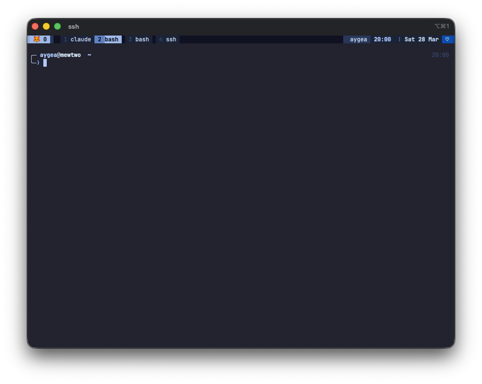

# AygeaNight

Tokyo Night base with Aygea brand accent colors. Baby blue, sapphire, pink, silver on dark navy.



> **This is a personal terminal theme for my own machines.** It's not a framework or library — just a collection of config files I use daily. If it's useful to you, cool, but I'm not supporting it or taking requests.

## What's included

| File | What it does |
|---|---|
| `AygeaNight.itermcolors` | iTerm2 color scheme |
| `tmux.conf` | tmux status bar and colors |
| `starship.toml` | Shell prompt theme |
| `fetch/aygeafetch.zsh` | System fetch for macOS (zsh) |
| `fetch/aygeafetch-ubuntu.sh` | System fetch for Ubuntu (bash) |
| `fetch/aygeafetch-arch.sh` | System fetch for Arch Linux (bash) |

## Setup guide

See [TERMINAL-SETUP.md](TERMINAL-SETUP.md) for full step-by-step install instructions.

## Install

**One command:**
```bash
./install.sh
```

**Or remote (curl pipe):**
```bash
curl -fsSL https://raw.githubusercontent.com/itsaygea/aygeaNight/main/install.sh | bash
```

Flags: `--sudo` · `--skip-fonts` · `--skip-tmux` · `--skip-starship` · `--skip-fetch` · `--uninstall`

The installer auto-detects your OS, installs all dependencies, and configures everything. It asks about sudo on Linux; defaults to user-level installs otherwise.

See [TERMINAL-SETUP.md](TERMINAL-SETUP.md) for full step-by-step manual instructions.

Run `./install.sh --help` for all options.

## Font

JetBrainsMono Nerd Font files are included in `fonts/JetBrainsMono/`. The installer copies them automatically.

## Colors

Baby Blue `#AFCBFF` · Soft Pink `#F8C8DC` · Silver `#E6EEF8` · Sapphire `#6A8FD3` · Pink Dark `#D88CA8` · Silver Dark `#C0D1E6` · Purple `#9480B9` · Purple Dark `#5A4878` · Deep Sapphire `#0F52BA` · Sapphire Dark `#083B89`

Background: Tokyo Night base `#0F1020`
