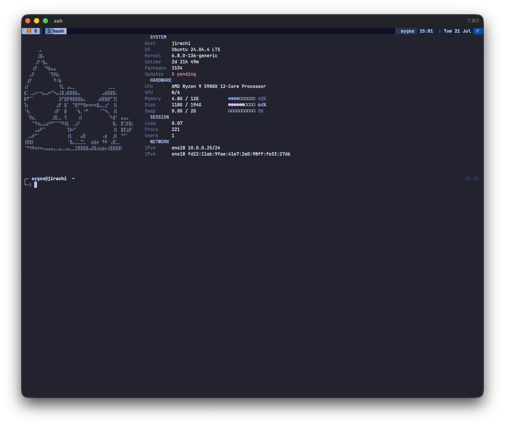

# AygeaNight

Tokyo Night base with Aygea brand accent colors. Baby blue, sapphire, pink, silver on dark navy.



> **This is a personal terminal theme for my own machines.** It's not a framework or library — just a collection of config files I use daily. If it's useful to you, cool, but I'm not supporting it or taking requests.

## What's included

| File | What it does |
|---|---|
| `AygeaNight.itermcolors` | iTerm2 color scheme |
| `tmux.conf` | tmux status bar and colors |
| `starship.toml` | Shell prompt theme |
| `fetch/aygeafetch-macos.sh` | System fetch wrapper for macOS |
| `fetch/aygeafetch-ubuntu.sh` | System fetch wrapper for Ubuntu / Debian / Pop |
| `fetch/aygeafetch-arch.sh` | System fetch wrapper for Arch / CachyOS / Manjaro |
| `fetch/_aygeafetch_core.sh` | Shared fetch engine (art, info, dot-meters) |
| `fetch/art/*.txt` | Dot-art fox + face designs (regular + inverted) |

## Install

**One command (clone the repo):**

```bash
./install.sh
```

**Or remote (curl pipe — no clone needed):**

```bash
curl -fsSL https://raw.githubusercontent.com/itsaygea/aygeaNights/main/install.sh | bash
```

Flags: `--sudo` · `--skip-fonts` · `--skip-tmux` · `--skip-starship` · `--skip-fetch` · `--uninstall`

The installer auto-detects your OS (macOS, Ubuntu/Debian, Arch/CachyOS/Manjaro) and your shell (zsh or bash), installs dependencies, and configures everything. It asks about sudo on Linux; defaults to user-level installs otherwise. The fetch step builds a single self-contained `aygeafetch` binary in `~/.local/bin` (engine + art inlined — no extra files scattered around).

See [TERMINAL-SETUP.md](TERMINAL-SETUP.md) for the full step-by-step manual process, and run `./install.sh --help` for all options.

## Fetch art variants

`aygeafetch` shows a dot-art laying fox by default. Switch designs with a flag or env var:

```bash
aygeafetch --fox        # laying fox        (default)
aygeafetch --fox-inv    # inverted laying fox
aygeafetch --face       # bordered fox face
aygeafetch --face-inv   # inverted blob face
aygeafetch --art face   # same as --face
```

Or set it permanently: `export AYGEAFETCH_ART=face` in your shell rc. The raw art lives in `fetch/art/*.txt` — edit those and the dev script picks up changes; re-run the installer to bake edits into the installed binary.

The fetch shows Ubuntu-MOTD-style info: pending **updates** count (apt/pacman/dnf/brew — green when 0, pink when pending), memory/disk/swap meters, load average, process count, logged-in users, and IPv4/IPv6 addresses.

Optional **Login MOTD** step (Linux, needs sudo) drops a script at `/etc/update-motd.d/99-aygea` (Ubuntu/Debian) or `/etc/profile.d/aygea-motd.sh` (Arch) so `aygeafetch` runs at every SSH/console login — like the distro welcome banner, but yours.

## Font

JetBrainsMono Nerd Font. If you clone the repo, the files are bundled in `fonts/JetBrainsMono/` and the installer copies them. If you curl-pipe install (no clone), the installer downloads the font from [Nerd Fonts](https://www.nerdfonts.com/) automatically. Either way: set **JetBrainsMono Nerd Font** in your terminal emulator after install.

## Colors

Baby Blue `#AFCBFF` · Soft Pink `#F8C8DC` · Silver `#E6EEF8` · Sapphire `#6A8FD3` · Pink Dark `#D88CA8` · Silver Dark `#C0D1E6` · Purple `#9480B9` · Purple Dark `#5A4878` · Deep Sapphire `#0F52BA` · Sapphire Dark `#083B89`

Background: Tokyo Night base `#0F1020`

## Screenshots

| | |
|---|---|
| tmux | `assets/tmux.png` |
| system fetch | _(add `assets/fetch.png` after installing on a system — `aygeafetch --fox`)_ |

